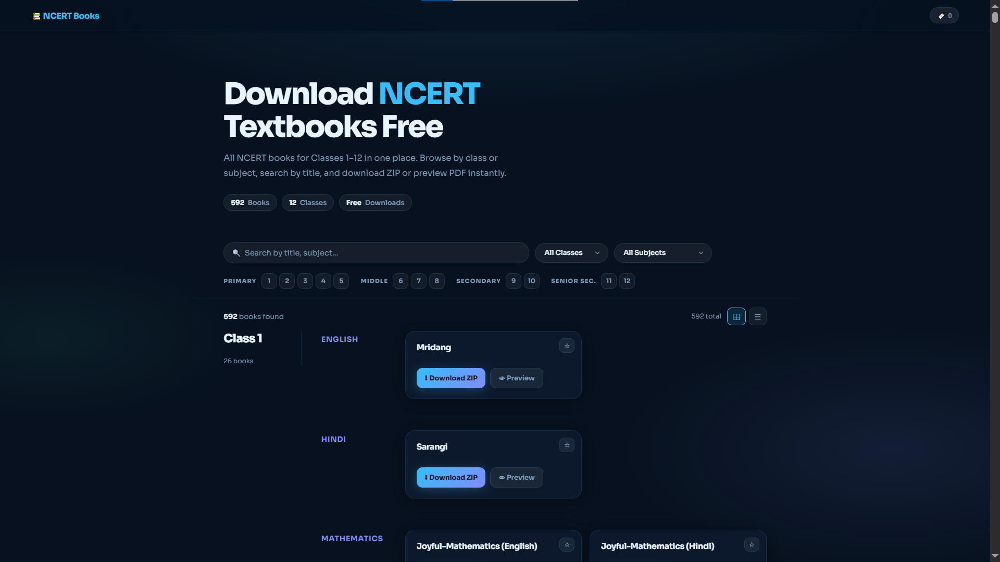

# 📚 NCERT PDF Downloader

A modern, fast, and user-friendly web application to browse and download NCERT textbooks for Classes 1 to 12. 



## 🌐 Live Demo
Experience the app live here: **[NCERT PDF Downloader](https://mayankhassija.github.io/ncert/)**

---

## ✨ Key Features

- **🎯 Smart Search**: Instantly find books by title, subject, or class.
- **🔍 Advanced Filtering**: Filter the library by Class or Subject with a single click.
- **🔖 Bookmark System**: Save your favorite books to a personal list for quick access (persists across sessions).
- **🌓 View Modes**: Switch between **Grid** and **List** views to suit your browsing preference.
- **⚡ Quick Navigation**: Use the "Quick Jump" bar to instantly navigate between primary, middle, and secondary sections.
- **📥 Direct Downloads**: Download entire books as ZIP files or preview individual PDFs directly in your browser.
- **📱 Responsive Design**: Fully optimized for desktops, tablets, and mobile devices.
- **🎨 Premium UI**: Beautiful glassmorphism-inspired design with smooth animations and dark mode aesthetics.

---

## 🛠️ Tech Stack

- **Frontend**: HTML5, Vanilla CSS3 (Custom Properties, Flexbox, Grid)
- **Logic**: Vanilla JavaScript (ES6+, Fetch API, LocalStorage)
- **Data Source**: Custom `books.json` containing direct links to NCERT resources.
- **Typography**: [Sora](https://fonts.google.com/specimen/Sora) and [JetBrains Mono](https://fonts.google.com/specimen/JetBrains+Mono).

---

## 🚀 Getting Started

### Prerequisites
You only need a modern web browser to run this project.

### Installation
1. Clone the repository:
   ```bash
   git clone https://github.com/mayankhassija/NCERT-PDF-DOWNLOADER.git
   ```
2. Navigate to the project directory:
   ```bash
   cd NCERT-PDF-DOWNLOADER
   ```
3. Open `index.html` in your browser.

---

## 📂 Project Structure

- `index.html`: The main entry point and UI structure.
- `styles.css`: Custom CSS library for the premium design system.
- `script.js`: Core application logic, including filtering, searching, and bookmarks.
- `books.json`: The database of all available NCERT books.
- `ncert.png`: Site favicon and branding.

---

## 🤝 Contributing

Contributions are welcome! If you have suggestions for new features or improvements, feel free to:
1. Fork the Project
2. Create your Feature Branch (`git checkout -b feature/AmazingFeature`)
3. Commit your Changes (`git commit -m 'Add some AmazingFeature'`)
4. Push to the Branch (`git push origin feature/AmazingFeature`)
5. Open a Pull Request

---

## 📜 License
Distributed under the MIT License.

---

*Note: This project is not officially affiliated with NCERT. All books are sourced from the official [NCERT website](https://ncert.nic.in).*
